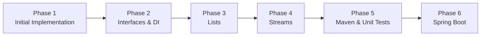
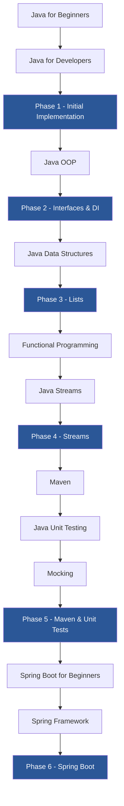
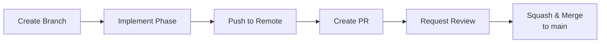
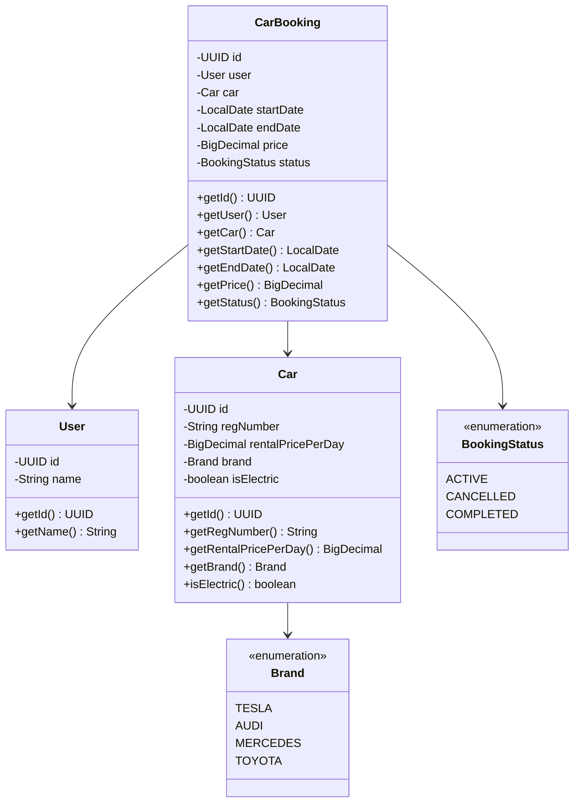
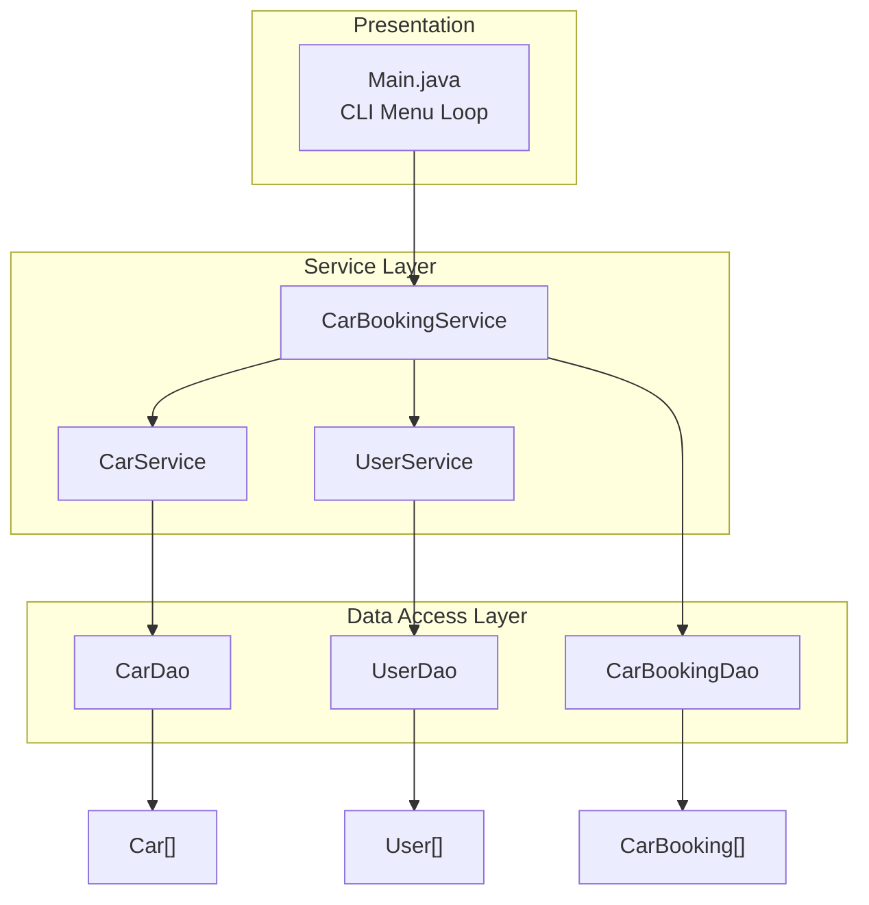
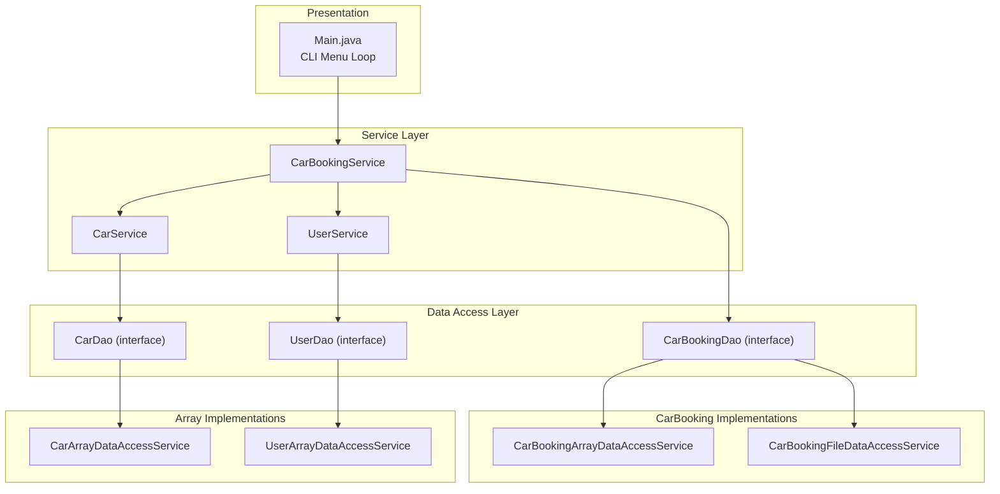
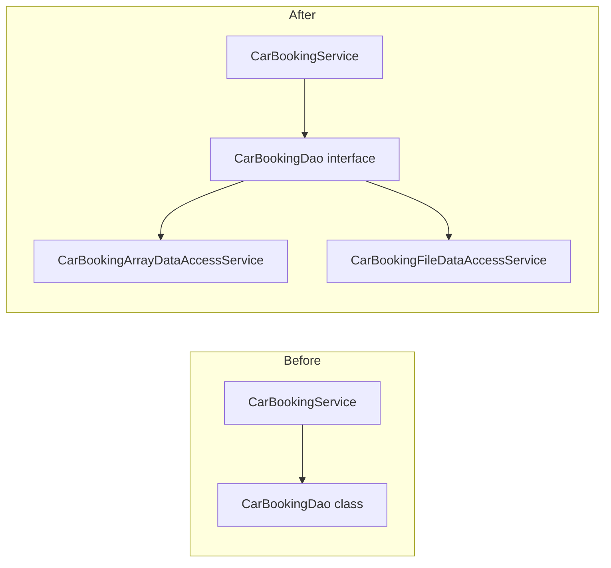
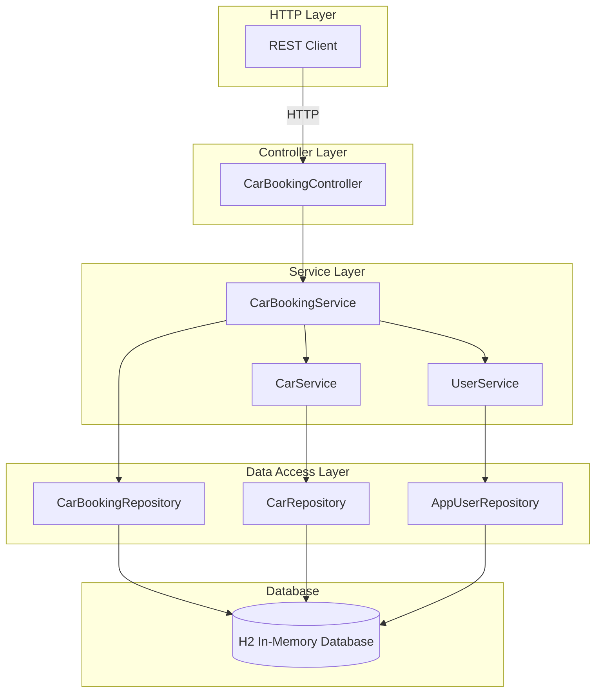
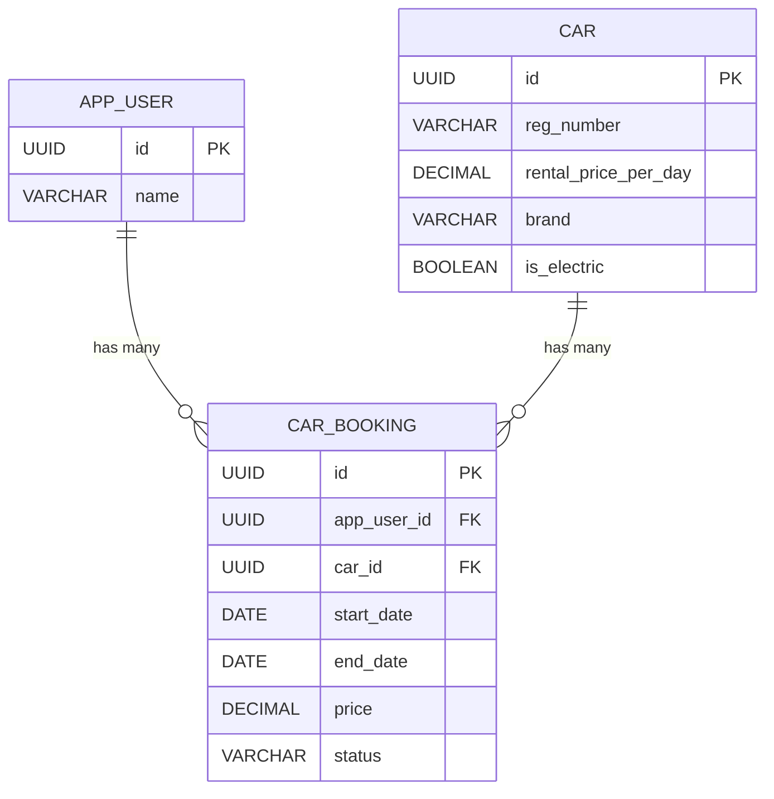
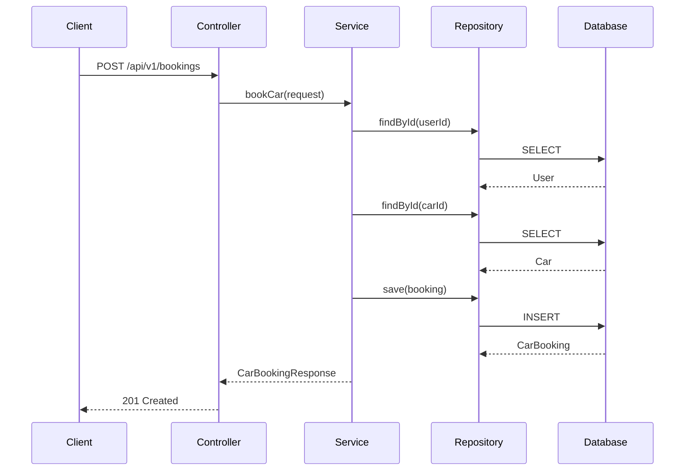

# Java CLI Build - Car Booking System

**Course:** Java CLI Build
**Prepared for:** Amigoscode Academy Students
**Level:** Junior/Mid-Level Java Engineering
**Repository:** [github.com/amigoscode/java-master-class](https://github.com/amigoscode/java-master-class)

---

## 1. Project Overview

Build a **Car Booking CLI System** from scratch and progressively refactor it through 6 phases, applying core Java concepts and software engineering best practices at each stage.

The student starts with a basic implementation using arrays and no design patterns, then iteratively improves the codebase by introducing interfaces and dependency injection, collections, streams, Maven with unit testing, and finally transforming the application into a Spring Boot REST API. Each phase is unlocked after completing the relevant Amigoscode courses.



### Learning Path

Each phase is preceded by the courses the student must complete before starting it.



| Phase | Required Courses |
|-------|-----------------|
| Phase 1 - Initial Implementation | Java for Beginners, Java for Developers |
| Phase 2 - Interfaces & DI | Java OOP |
| Phase 3 - Lists | Java Data Structures |
| Phase 4 - Streams | Functional Programming, Java Streams |
| Phase 5 - Maven & Unit Tests | Maven, Java Unit Testing, Mocking |
| Phase 6 - Spring Boot | Spring Boot for Beginners, Spring Framework |

---

## 2. System Requirements

As an admin for a car company, the student must develop a CLI system that supports the following operations:

```
1 - Book Car
2 - Delete Booking
3 - View All User Booked Cars
4 - View All Bookings
5 - View Available Cars
6 - View Available Electric Cars
7 - View All Users
8 - Exit
```

### Functional Requirements

| ID | Requirement | Description |
|----|-------------|-------------|
| FR-01 | Book a Car | System prompts for user ID, car selection, start date and end date. Price is calculated from the car's rental price per day. A car that is already booked cannot be booked again |
| FR-02 | Delete Booking | Cancel an existing booking by booking ID, making the car available again |
| FR-03 | View User Bookings | Display all cars booked by a specific user |
| FR-04 | View All Bookings | Display every booking in the system |
| FR-05 | View Available Cars | List all cars not currently booked |
| FR-06 | View Electric Cars | Filter and display only available electric cars |
| FR-07 | View All Users | List all registered users |
| FR-08 | Exit | Gracefully terminate the application |

### Non-Functional Requirements

- Each user must have a unique identifier (UUID) generated by the system
- The system must support static seed data for users and cars
- Bookings are created at runtime (not pre-seeded)
- The CLI must loop until the user selects Exit

---

## 3. Git Workflow

Each phase follows the same workflow:



1. Create a new branch for the phase: `git checkout -b <branch-name>`
2. Implement the requirements
3. Push to remote: `git push origin <branch-name>`
4. Create a pull request: `gh pr create`
5. Request a review from the [Amigoscode Academy community](https://www.skool.com/amigoscode-academy/request-code-review-here)
6. Once approved, squash and merge to `main`

---

## 4. Domain Model



---

## 5. Phase Summary

| Phase | Branch | Key Concepts | Difficulty |
|-------|--------|-------------|------------|
| 1 | `initial-implementation` | POJOs, arrays, basic OOP, CLI I/O | Beginner |
| 2 | `interfaces-and-di` | Interfaces, polymorphism, serialization, file I/O, constructor injection | Mid |
| 3 | `lists` | Collections framework, generics | Mid |
| 4 | `streams` | Streams API, lambdas, method references | Mid |
| 5 | `maven-and-tests` | Build tools, dependency management, JUnit 5, Mockito | Mid-Advanced |
| 6 | `spring-boot` | Spring Boot, REST APIs, Spring Data JPA | Advanced |

---

## 6. Getting Started

The starter template is available at [github.com/amigoscode/java-master-class](https://github.com/amigoscode/java-master-class). There are two ways to set up the project:

### Option A - Create from Template (Recommended)

1. Go to [github.com/amigoscode/java-master-class](https://github.com/amigoscode/java-master-class)
2. Click **"Use this template"** → **"Create a new repository"**
3. Name the repository (e.g. `java-master-class`) and create it under your own GitHub account
4. Clone your new repository:

```bash
git clone git@github.com:<your-username>/java-master-class.git
```

### Option B - Clone and Re-point Remote

1. Clone the template repository:

```bash
git clone git@github.com:amigoscode/java-master-class.git
```

2. Create a new empty repository on your GitHub account (e.g. `java-master-class`)

3. Re-point the remote to your own repository:

```bash
cd java-master-class
git remote set-url origin git@github.com:<your-username>/java-master-class.git
```

4. Push to your new remote:

```bash
git push -u origin main
```

### Then

1. Create the first branch:

```bash
git checkout -b initial-implementation
```

2. Create a package with your name and move `Main.java` inside it:

```
src/com/<yourname>/Main.java
```

For example, if your name is Franco: `src/com/franco/Main.java`

The starter `Main.java` contains TODOs to guide the first steps:

```java
// TODO 1. create a new branch called initial-implementation
// TODO 2. create a package with your name. i.e com.franco and move this file inside the new package
// TODO 3. implement https://amigoscode.com/learn/java-cli-build/lectures/3a83ecf3-e837-4ae5-85a8-f8ae3f60f7f5

public class Main {

    public static void main(String[] args) {
        System.out.println("Java Master Class");
    }
}
```

After moving, update the package declaration:

```java
package com.franco;

public class Main {

    public static void main(String[] args) {
        System.out.println("Java Master Class");
    }
}
```

3. Begin implementing Phase 1

---

## 7. Implementation Phases

### Phase 1 - Initial Implementation

**Prerequisite courses:** Java for Beginners, Java for Developers

**Branch:** `initial-implementation`

Build the complete CLI application from scratch.

**Architecture:**



**Constraints:**

| Constraint | Details |
|------------|---------|
| Data storage | Arrays only |
| Design patterns | None (no interfaces, no DI) |
| Build tool | None (plain Java) |
| Testing | Manual only |
| Collections | Arrays only (no Lists) |
| Streams | Not allowed |

**Package structure:**

```
src/
└── com/
    └── amigoscode/
        ├── Main.java
        ├── car/
        │   ├── Brand.java
        │   ├── Car.java
        │   ├── CarDao.java
        │   └── CarService.java
        ├── user/
        │   ├── User.java
        │   ├── UserDao.java
        │   └── UserService.java
        └── booking/
            ├── CarBooking.java
            ├── CarBookingDao.java
            └── CarBookingService.java
```

**Key tasks:**
- Create POJO classes: `User`, `Car`, `CarBooking`, `Brand` enum
- Create DAO classes: `UserDao`, `CarDao`, `CarBookingDao`
- Create service classes for business logic
- Implement the CLI menu loop in `Main.java`
- Seed static data for users and cars
- Implement all 8 menu options

**Important:** When booking a car, the system must check if the car is already booked. If it is, reject the booking and inform the user. A car becomes available again only after its booking is deleted.

```java
public void bookCar(User user, Car car) {
    // 1. Get all current bookings
    // 2. Check if any booking already has this car
    // 3. If yes → throw exception or print error
    // 4. If no → create and save the booking
}
```

**Seed data example:**

```java
private static final User[] users;

static {
    users = new User[]{
        new User(UUID.fromString("8ca51d2b-aaaf-4bf2-834a-e02964e10fc3"), "James"),
        new User(UUID.fromString("b10d126a-3608-4980-9f9c-aa179f5cebc3"), "Jamila")
    };
}
```

**UUID generation:** Use `java.util.UUID` or generate via terminal:

```bash
for i in {1..10}; do
    uuid=$(uuidgen | tr '[:upper:]' '[:lower:]')
    echo $uuid
done
```

#### Submit

```bash
git add .
git commit -m "feat: implement car booking cli system"
git push origin initial-implementation
gh pr create
```

Request a review from the [Amigoscode Academy community](https://www.skool.com/amigoscode-academy). Once approved, squash and merge the PR to `main`.

---

### Phase 2 - Interfaces & Dependency Injection

**Prerequisite courses:** Java OOP

**Branch:** `interfaces-and-di`

#### Before starting

After squashing and merging Phase 1, sync your local `main` and create the new branch:

```bash
git checkout main
git pull origin main
git checkout -b interfaces-and-di
```

Refactor the data access layer to use interfaces and apply dependency injection throughout the codebase.

**Target architecture:**



**Package structure:**

```
src/
└── com/
    └── amigoscode/
        ├── Main.java
        ├── car/
        │   ├── Brand.java
        │   ├── Car.java
        │   ├── CarDao.java                          (interface: getCars, findCarById)
        │   ├── CarArrayDataAccessService.java       (implements CarDao)
        │   └── CarService.java
        ├── user/
        │   ├── User.java
        │   ├── UserDao.java                         (interface: getUsers, findUserById)
        │   ├── UserArrayDataAccessService.java      (implements UserDao)
        │   └── UserService.java
        └── booking/
            ├── CarBooking.java
            ├── CarBookingDao.java                   (interface: getBookings, findBookingById,
            │                                         saveBooking, deleteBooking)
            ├── CarBookingArrayDataAccessService.java (implements CarBookingDao)
            ├── CarBookingFileDataAccessService.java  (implements CarBookingDao - serialization)
            └── CarBookingService.java
```

#### Part A - Extract Interfaces

Extract DAO classes into interfaces and keep the existing array-backed implementations.

**CarBookingDao interface:**

```java
public interface CarBookingDao {
    CarBooking[] getBookings();
    CarBooking findBookingById(UUID bookingId);
    void saveBooking(CarBooking booking);
    void deleteBooking(UUID bookingId);
}
```

**CarDao interface:**

```java
public interface CarDao {
    Car[] getCars();
    Car findCarById(UUID carId);
}
```

**UserDao interface:**

```java
public interface UserDao {
    User[] getUsers();
    User findUserById(UUID userId);
}
```

Rename the existing DAO classes to `*ArrayDataAccessService` and have them implement the new interfaces.



#### Part B - File-Based Implementation (CarBookingDao only)

Create a second implementation for `CarBookingDao` that persists bookings to a file using Java serialization.

The student must figure out how to serialize and deserialize Java objects to/from files. This is a research task — serialization has not been covered in prior courses.

**Hints:**
- POJOs must implement `java.io.Serializable`
- Use `ObjectOutputStream` to write objects to a file
- Use `ObjectInputStream` to read objects back
- The file-based implementation should read from / write to a file (e.g. `bookings.dat`)

> **Bonus:** If the student wants extra practice, they can also create file-based implementations for `CarDao` and `UserDao`. This is optional.

**Example structure:**

```java
public class CarBookingFileDataAccessService implements CarBookingDao {

    private final String filePath;

    public CarBookingFileDataAccessService(String filePath) {
        this.filePath = filePath;
    }

    @Override
    public void saveBooking(CarBooking booking) {
        // Read existing bookings from file
        // Add new booking
        // Write all bookings back to file
    }

    @Override
    public void deleteBooking(UUID bookingId) {
        // Read existing bookings from file
        // Remove booking with matching ID
        // Write remaining bookings back to file
    }

    // ... other methods
}
```

#### Part C - Dependency Injection

Remove all `new` keyword instantiations from service classes. All dependencies must be injected via constructors.

**Before:**

```java
public class CarBookingService {
    private final CarBookingDao carBookingDao = new CarBookingDao();
    private final CarService carService = new CarService();
}
```

**After:**

```java
public class CarBookingService {
    private final CarBookingDao carBookingDao;
    private final CarService carService;

    public CarBookingService(CarBookingDao carBookingDao, CarService carService) {
        this.carBookingDao = carBookingDao;
        this.carService = carService;
    }
}
```

**Wiring in Main.java** — the student can now swap between array and file implementations for bookings:

```java
public static void main(String[] args) {
    // Swap booking implementation here
    CarBookingDao carBookingDao = new CarBookingFileDataAccessService("bookings.dat");
    // CarBookingDao carBookingDao = new CarBookingArrayDataAccessService();

    CarDao carDao = new CarArrayDataAccessService();
    CarService carService = new CarService(carDao);

    UserDao userDao = new UserArrayDataAccessService();
    UserService userService = new UserService(userDao);

    CarBookingService carBookingService = new CarBookingService(
        carBookingDao, carService
    );
}
```

#### Submit

```bash
git add .
git commit -m "refactor: extract dao interfaces and apply dependency injection"
git push origin interfaces-and-di
gh pr create
```

Request a review from the [Amigoscode Academy community](https://www.skool.com/amigoscode-academy). Once approved, squash and merge the PR to `main`.

---

### Phase 3 - Lists

**Prerequisite courses:** Java Data Structures

**Branch:** `lists`

#### Before starting

```bash
git checkout main
git pull origin main
git checkout -b lists
```

Replace all array usage with `java.util.List` throughout the entire codebase.

**Before:**

```java
User[] users = userService.getUsers();
CarBooking[] bookings = carBookingService.getBookings();
```

**After:**

```java
List<User> users = userService.getUsers();
List<CarBooking> bookings = carBookingService.getBookings();
```

**Impact:** This change touches every layer — DAO interfaces, all implementations (array and file-based), services, and the menu display logic. Use `ArrayList` for mutable lists and `Collections.emptyList()` for empty returns.

Update all DAO interfaces to return and accept `List<T>` instead of arrays.

#### Submit

```bash
git add .
git commit -m "refactor: replace arrays with lists"
git push origin lists
gh pr create
```

Request a review from the [Amigoscode Academy community](https://www.skool.com/amigoscode-academy). Once approved, squash and merge the PR to `main`.

---

### Phase 4 - Streams

**Prerequisite courses:** Functional Programming, Java Streams

**Branch:** `streams`

#### Before starting

```bash
git checkout main
git pull origin main
git checkout -b streams
```

Refactor imperative loops to use the Java Streams API for filtering, mapping, and collecting data.

**Before (imperative):**

```java
public List<Car> getAllElectricCars() {
    List<Car> cars = getAllCars();
    if (cars.size() == 0) {
        return Collections.emptyList();
    }
    List<Car> electricCars = new ArrayList<>();
    for (Car car : cars) {
        if (car.isElectric()) {
            electricCars.add(car);
        }
    }
    return electricCars;
}
```

**After (streams):**

```java
public List<Car> getAllElectricCars() {
    return getAllCars().stream()
        .filter(Car::isElectric)
        .collect(Collectors.toList());
}
```

Apply streams wherever filtering, transformation, or collection operations occur.

#### Submit

```bash
git add .
git commit -m "refactor: replace imperative loops with streams"
git push origin streams
gh pr create
```

Request a review from the [Amigoscode Academy community](https://www.skool.com/amigoscode-academy). Once approved, squash and merge the PR to `main`.

---

### Phase 5 - Maven & Unit Tests

**Prerequisite courses:** Maven, Java Unit Testing, Mocking

**Branch:** `maven-and-tests`

#### Before starting

```bash
git checkout main
git pull origin main
git checkout -b maven-and-tests
```

**Package structure (after Maven conversion):**

```
src/
├── main/
│   ├── java/
│   │   └── com/
│   │       └── amigoscode/
│   │           ├── Main.java
│   │           ├── car/
│   │           │   ├── Brand.java
│   │           │   ├── Car.java
│   │           │   ├── CarDao.java
│   │           │   ├── CarArrayDataAccessService.java
│   │           │   ├── CarFakerDataAccessService.java
│   │           │   └── CarService.java
│   │           ├── user/
│   │           │   ├── User.java
│   │           │   ├── UserDao.java
│   │           │   ├── UserArrayDataAccessService.java
│   │           │   ├── UserFakerDataAccessService.java
│   │           │   └── UserService.java
│   │           └── booking/
│   │               ├── CarBooking.java
│   │               ├── CarBookingDao.java
│   │               ├── CarBookingArrayDataAccessService.java
│   │               ├── CarBookingFileDataAccessService.java
│   │               └── CarBookingService.java
│   └── resources/
│       └── users.csv
├── test/
│   └── java/
│       └── com/
│           └── amigoscode/
│               ├── booking/
│               │   ├── CarBookingServiceTest.java
│               │   ├── CarBookingArrayDataAccessServiceTest.java
│               │   └── CarBookingFileDataAccessServiceTest.java
│               ├── car/
│               │   ├── CarServiceTest.java
│               │   └── CarArrayDataAccessServiceTest.java
│               └── user/
│                   ├── UserServiceTest.java
│                   └── UserArrayDataAccessServiceTest.java
└── pom.xml
```

#### Part A - Convert to Maven

Convert the project from a plain Java project to a Maven project.

**Tasks:**
1. Create standard Maven directory structure (`src/main/java`, `src/main/resources`)
2. Create `pom.xml` with project coordinates
3. Move data files to `src/main/resources/`
4. Update file reading to use classpath:

```java
// Before - hardcoded path relative to project root (breaks in Maven)
File file = new File("src/com/amigoscode/users.csv");

// After - loads from classpath (src/main/resources/)
File file = new File(
    getClass().getClassLoader().getResource("users.csv").getPath()
);
```

How this works:
- `getClass()` — gets the current class
- `.getClassLoader()` — gets the classloader that loaded this class
- `.getResource("users.csv")` — looks for `users.csv` on the classpath (Maven compiles `src/main/resources/` into the classpath automatically)
- `.getPath()` — converts the resource URL to a file path string

In Maven, files under `src/main/resources/` are copied to the classpath at build time, so this approach works regardless of where the project is run from.

#### Part B - Faker DAO Implementations

Add the JavaFaker dependency and create new DAO implementations that generate random data.

```xml
<dependency>
    <groupId>com.github.javafaker</groupId>
    <artifactId>javafaker</artifactId>
    <version>1.0.2</version>
</dependency>
```

**Tasks:**
1. Create `UserFakerDataAccessService` implementing `UserDao` — generate 20 random users using `faker.name().fullName()`
2. Create `CarFakerDataAccessService` implementing `CarDao` — generate random cars using faker (e.g. `faker.lorem().word()` for reg numbers, random `Brand` enum values, random prices, random `isElectric`)

> **Note:** JavaFaker does not have a built-in car provider. The student should explore what faker offers and get creative with generating realistic car data.

**Example:**

```java
public class UserFakerDataAccessService implements UserDao {

    @Override
    public List<User> getUsers() {
        Faker faker = new Faker();
        List<User> users = new ArrayList<>();
        for (int i = 0; i < 20; i++) {
            users.add(new User(UUID.randomUUID(), faker.name().fullName()));
        }
        return users;
    }

    // ... other methods
}
```

These can be swapped in via dependency injection in `Main.java`:

```java
UserDao userDao = new UserFakerDataAccessService();
// UserDao userDao = new UserArrayDataAccessService();
```

#### Part C - Unit Tests

Write unit tests for all services and DAO implementations (array and file only — no need to test faker DAOs).

**Stack:**
- JUnit 5
- Mockito

**Maven dependencies:**

```xml
<dependency>
    <groupId>org.junit.jupiter</groupId>
    <artifactId>junit-jupiter</artifactId>
    <version>5.10.0</version>
    <scope>test</scope>
</dependency>
<dependency>
    <groupId>org.mockito</groupId>
    <artifactId>mockito-core</artifactId>
    <version>5.5.0</version>
    <scope>test</scope>
</dependency>
```

**What to test:**

**Services (mock all dependencies with Mockito):**

| Class | Dependencies to mock | What to test |
|-------|---------------------|-------------|
| `CarBookingService` | `CarBookingDao`, `CarService`, `UserService` | Book car, delete booking, get bookings, find by ID |
| `CarService` | `CarDao` | Get all cars, find by ID, get electric cars |
| `UserService` | `UserDao` | Get all users, find by ID |

**Array DAOs (no mocking needed — test directly):**

| Class | What to test |
|-------|-------------|
| `CarBookingArrayDataAccessService` | Save, delete, get all, find by ID |
| `CarArrayDataAccessService` | Get all cars, find by ID |
| `UserArrayDataAccessService` | Get all users, find by ID |

**File DAO (use temp files):**

| Class | What to test |
|-------|-------------|
| `CarBookingFileDataAccessService` | Save booking to file, delete booking from file, read bookings from file |

Use JUnit's `@TempDir` to create a temporary file for each test so tests don't interfere with each other:

```java
class CarBookingFileDataAccessServiceTest {

    @TempDir
    Path tempDir;

    private CarBookingFileDataAccessService underTest;

    @BeforeEach
    void setUp() {
        String filePath = tempDir.resolve("bookings.dat").toString();
        underTest = new CarBookingFileDataAccessService(filePath);
    }

    @Test
    void itShouldSaveAndRetrieveBooking() {
        // Given
        CarBooking booking = new CarBooking(...);

        // When
        underTest.saveBooking(booking);
        List<CarBooking> bookings = underTest.getBookings();

        // Then
        assertThat(bookings).hasSize(1);
        assertThat(bookings.get(0).getId()).isEqualTo(booking.getId());
    }

    @Test
    void itShouldDeleteBooking() {
        // Given
        CarBooking booking = new CarBooking(...);
        underTest.saveBooking(booking);

        // When
        underTest.deleteBooking(booking.getId());

        // Then
        assertThat(underTest.getBookings()).isEmpty();
    }
}
```

#### Submit

```bash
git add .
git commit -m "build: convert to maven and add unit tests"
git push origin maven-and-tests
gh pr create
```

Request a review from the [Amigoscode Academy community](https://www.skool.com/amigoscode-academy). Once approved, squash and merge the PR to `main`.

---

### Phase 6 - Spring Boot

Transform the CLI application into a Spring Boot REST API in a **new repository**.

**Architecture:**



#### Step 1 - Set Up the Spring Boot Project

The Spring Boot starter template is available at [github.com/amigoscode/java-master-class-spring-boot](https://github.com/amigoscode/java-master-class). This is a **separate repository** from the CLI project.

Create or clone the starter (same options as Getting Started):

```bash
# Option A: Use template on GitHub then clone
git clone git@github.com:<your-username>/java-master-class-spring-boot.git

# Option B: Clone and re-point
git clone git@github.com:amigoscode/java-master-class-spring-boot.git
cd java-master-class-spring-boot
git remote set-url origin git@github.com:<your-username>/java-master-class-spring-boot.git
git push -u origin main
```

The starter comes pre-configured with:

- **Spring Boot 4.0.2** with **Java 25**
- **Spring Web** for REST endpoints
- **Spring Data JPA** for database access
- **H2** embedded in-memory database
- `application.yml` configured to run on **port 8080**

Verify the project runs:

```bash
./mvnw spring-boot:run
```

The application should start on `http://localhost:8080`. The H2 console is available at `http://localhost:8080/h2-console`.

#### Step 2 - Copy Domain Classes

Copy POJOs and enums from the CLI project into the Spring Boot project:

- `Brand.java` → `src/main/java/com/<yourname>/car/`
- `Car.java` → `src/main/java/com/<yourname>/car/`
- `User.java` → rename to `AppUser.java` → `src/main/java/com/<yourname>/user/`
- `CarBooking.java` → `src/main/java/com/<yourname>/booking/`

#### Step 3 - Annotate Entities

Convert POJOs to JPA entities. The DAO interfaces from the CLI project are **no longer needed** — Spring Data JPA replaces them with repositories.

```java
@Entity
@Table(name = "car")
public class Car {

    @Id
    @GeneratedValue(strategy = GenerationType.UUID)
    private UUID id;

    @Column(nullable = false, unique = true)
    private String regNumber;

    @Column(nullable = false)
    private BigDecimal rentalPricePerDay;

    @Enumerated(EnumType.STRING)
    @Column(nullable = false)
    private Brand brand;

    @Column(nullable = false)
    private boolean isElectric;

    // constructors, getters, setters
}
```

> **Note:** `User` is a reserved keyword in most SQL databases and can conflict with Spring Data JPA. Rename the class to `AppUser` and map it to the `app_user` table.

```java
@Entity
@Table(name = "app_user")
public class AppUser {

    @Id
    @GeneratedValue(strategy = GenerationType.UUID)
    private UUID id;

    @Column(nullable = false)
    private String name;

    // constructors, getters, setters
}
```

```java
@Entity
@Table(name = "car_booking")
public class CarBooking {

    @Id
    @GeneratedValue(strategy = GenerationType.UUID)
    private UUID id;

    @ManyToOne
    @JoinColumn(name = "app_user_id", nullable = false)
    private AppUser user;

    @ManyToOne
    @JoinColumn(name = "car_id", nullable = false)
    private Car car;

    @Column(nullable = false)
    private LocalDate startDate;

    @Column(nullable = false)
    private LocalDate endDate;

    @Column(nullable = false)
    private BigDecimal price;

    @Enumerated(EnumType.STRING)
    @Column(nullable = false)
    private BookingStatus status;

    // constructors, getters, setters
}
```

```java
public enum BookingStatus {
    ACTIVE,
    CANCELLED,
    COMPLETED
}
```

**Entity Relationship Diagram:**



- An **AppUser** can have many **CarBookings** (one-to-many)
- A **Car** can have many **CarBookings** (one-to-many)
- A **CarBooking** belongs to exactly one **AppUser** and one **Car** (many-to-one)

This means `CAR_BOOKING` is the join table that holds `app_user_id` and `car_id` as foreign keys. In JPA this is modelled with `@ManyToOne` on the `CarBooking` entity.

**Entity tables (H2 database):**

| Table | Column | Type | Constraints | Description |
|-------|--------|------|-------------|-------------|
| **app_user** | id | UUID | PK, auto-generated | Unique identifier |
| | name | VARCHAR | NOT NULL | User's display name |
| **car** | id | UUID | PK, auto-generated | Unique identifier |
| | reg_number | VARCHAR | NOT NULL, UNIQUE | Vehicle registration number |
| | rental_price_per_day | DECIMAL | NOT NULL | Daily rental cost |
| | brand | VARCHAR | NOT NULL | Enum: TESLA, AUDI, MERCEDES, TOYOTA |
| | is_electric | BOOLEAN | NOT NULL | Whether the car is electric |
| **car_booking** | id | UUID | PK, auto-generated | Unique identifier |
| | app_user_id | UUID | FK → app_user, NOT NULL | The user who booked |
| | car_id | UUID | FK → car, NOT NULL | The car that was booked |
| | start_date | DATE | NOT NULL | Booking start date |
| | end_date | DATE | NOT NULL | Booking end date |
| | price | DECIMAL | NOT NULL | Calculated: rental_price_per_day × number of days |
| | status | VARCHAR | NOT NULL | Enum: ACTIVE, CANCELLED, COMPLETED |

No UNIQUE constraint on `car_id` — the same car can be rebooked after its previous booking is deleted. The double-booking prevention is handled at the service level only.

#### Step 4 - Create Repositories

Replace the DAO interfaces with Spring Data JPA repositories:

```java
public interface CarBookingRepository extends JpaRepository<CarBooking, UUID> {
    List<CarBooking> findByUserId(UUID userId);
}
```

```java
public interface CarRepository extends JpaRepository<Car, UUID> {
}
```

```java
public interface AppUserRepository extends JpaRepository<AppUser, UUID> {
}
```

#### Step 5 - Create DTOs

Use DTOs for request and response bodies instead of exposing entities directly.

**Request DTOs:**

```java
public record CarBookingRequest(UUID userId, UUID carId, LocalDate startDate, LocalDate endDate) {}
```

**Response DTOs:**

```java
public record CarResponse(
    UUID id,
    String regNumber,
    BigDecimal rentalPricePerDay,
    Brand brand,
    boolean isElectric
) {}
```

```java
public record CarBookingResponse(
    UUID id,
    String userName,
    String carRegNumber,
    Brand carBrand,
    LocalDate startDate,
    LocalDate endDate,
    BigDecimal price,
    BookingStatus status
) {}
```

Create DTOs for each entity and map between entities and DTOs in the service layer.

#### Step 6 - Create Services

Annotate services with `@Service` and inject repositories:

```java
@Service
public class CarBookingService {

    private final CarBookingRepository carBookingRepository;
    private final CarService carService;
    private final UserService userService;

    public CarBookingService(CarBookingRepository carBookingRepository,
                             CarService carService,
                             UserService userService) {
        this.carBookingRepository = carBookingRepository;
        this.carService = carService;
        this.userService = userService;
    }

    public CarBookingResponse bookCar(CarBookingRequest request) {
        // TODO
    }
}
```

**`bookCar` requirements:**
- Validate user and car exist
- Prevent double booking — only `ACTIVE` bookings count. Ideally enforce at DB level with a partial unique index e.g. `UNIQUE(car_id) WHERE status = 'ACTIVE'`, but H2 does not support partial indexes
- Validate end date is after start date
- Calculate price: `rentalPricePerDay × number of days`
- Save booking with status `ACTIVE`
- Map to response DTO and return

#### Step 7 - Create Controllers

Create REST controllers with endpoints:

```java
@RestController
@RequestMapping("api/v1/bookings")
public class CarBookingController {

    private final CarBookingService carBookingService;

    public CarBookingController(CarBookingService carBookingService) {
        this.carBookingService = carBookingService;
    }

    @PostMapping
    public ResponseEntity<CarBookingResponse> bookCar(@RequestBody CarBookingRequest request) {
        // ...
    }

    @DeleteMapping("{bookingId}")
    public void deleteBooking(@PathVariable UUID bookingId) {
        // ...
    }
}
```

**Endpoint mapping:**

| HTTP Method | Endpoint | Description |
|-------------|----------|-------------|
| POST | `/api/v1/bookings` | Book a car |
| DELETE | `/api/v1/bookings/{bookingId}` | Delete a booking |
| GET | `/api/v1/bookings/user/{userId}` | View user's bookings |
| GET | `/api/v1/bookings` | View all bookings |
| GET | `/api/v1/cars/available` | View available cars |
| GET | `/api/v1/cars/available/electric` | View available electric cars |
| GET | `/api/v1/users` | View all users |



#### Step 8 - Seed Data

Seed the database with initial users and cars on application startup using a `CommandLineRunner`:

```java
@Bean
CommandLineRunner commandLineRunner(AppUserRepository appUserRepository,
                                    CarRepository carRepository) {
    return args -> {
        AppUser james = new AppUser("James");
        AppUser jamila = new AppUser("Jamila");
        appUserRepository.saveAll(List.of(james, jamila));

        Car tesla = new Car("TE-001", new BigDecimal("29.99"), Brand.TESLA, true);
        Car audi = new Car("AU-002", new BigDecimal("24.99"), Brand.AUDI, false);
        Car mercedes = new Car("ME-003", new BigDecimal("34.99"), Brand.MERCEDES, false);
        Car toyota = new Car("TO-004", new BigDecimal("19.99"), Brand.TOYOTA, false);
        Car teslaX = new Car("TE-005", new BigDecimal("39.99"), Brand.TESLA, true);
        carRepository.saveAll(List.of(tesla, audi, mercedes, toyota, teslaX));
    };
}
```

Place this bean in the `Main` class (annotated with `@SpringBootApplication`). The data is inserted into H2 on every startup since the database is in-memory.

#### Step 9 - Unit Tests

Write unit tests for services and integration tests for controllers.

**Services** — mock repositories with Mockito (same approach as Phase 5):

| Class | Dependencies to mock | What to test |
|-------|---------------------|-------------|
| `CarBookingService` | `CarBookingRepository`, `CarService`, `UserService` | Book car, delete booking, get bookings, find by user |
| `CarService` | `CarRepository` | Get all cars, find by ID, get available, get electric |
| `UserService` | `AppUserRepository` | Get all users, find by ID |

**Package structure:**

```
src/
├── main/
│   ├── java/
│   │   └── com/
│   │       └── <yourname>/
│   │           ├── Main.java                       (@SpringBootApplication)
│   │           ├── car/
│   │           │   ├── Brand.java
│   │           │   ├── Car.java                    (@Entity)
│   │           │   ├── CarRepository.java          (extends JpaRepository)
│   │           │   ├── CarResponse.java            (DTO)
│   │           │   ├── CarService.java             (@Service)
│   │           │   └── CarController.java          (@RestController)
│   │           ├── user/
│   │           │   ├── AppUser.java                 (@Entity)
│   │           │   ├── AppUserRepository.java       (extends JpaRepository)
│   │           │   ├── UserResponse.java           (DTO)
│   │           │   ├── UserService.java            (@Service)
│   │           │   └── UserController.java         (@RestController)
│   │           └── booking/
│   │               ├── BookingStatus.java           (enum: ACTIVE, CANCELLED, COMPLETED)
│   │               ├── CarBooking.java             (@Entity)
│   │               ├── CarBookingRepository.java   (extends JpaRepository)
│   │               ├── CarBookingRequest.java      (DTO)
│   │               ├── CarBookingResponse.java     (DTO)
│   │               ├── CarBookingService.java      (@Service)
│   │               └── CarBookingController.java   (@RestController)
│   └── resources/
│       └── application.yml
├── test/
│   └── java/
│       └── com/
│           └── <yourname>/
│               ├── booking/
│               │   └── CarBookingServiceTest.java
│               ├── car/
│               │   └── CarServiceTest.java
│               └── user/
│                   └── UserServiceTest.java
└── pom.xml
```

#### Submit

```bash
git add .
git commit -m "feat: implement spring boot rest api"
git push origin main
gh pr create
```

Request a review from the [Amigoscode Academy community](https://www.skool.com/amigoscode-academy). Once approved, squash and merge the PR to `main`.

---

## 8. Solution References

Each phase has a reference implementation available:

| Phase | Commit |
|-------|--------|
| Phase 1 - Initial Implementation | [3de9b85](https://github.com/amigoscode/java-master-class/commit/3de9b854b8240db7220ac458d7d23b4350bd5cfe) |
| Phase 2 - Interfaces & DI | [4389fb2](https://github.com/amigoscode/java-master-class/commit/4389fb2fa4c0f590de7e37aa790f8d0bb67a41a0), [09fc1e8](https://github.com/amigoscode/java-master-class/commit/09fc1e8ac9756575033758dfeed02f00e9c93bb0) |
| Phase 3 - Lists | [7454dbf](https://github.com/amigoscode/java-master-class/commit/7454dbfb898c8b15d8c6af225203d84c9c11119f) |
| Phase 4 - Streams | [3dea1d0](https://github.com/amigoscode/java-master-class/commit/3dea1d0d228329d45048fda82d7ff3a25dfcdfa4) |
| Phase 5 - Maven & Unit Tests | [db69db8](https://github.com/amigoscode/java-master-class/commit/db69db8ca9a099548582cf65cf569d195dd24bec) |
